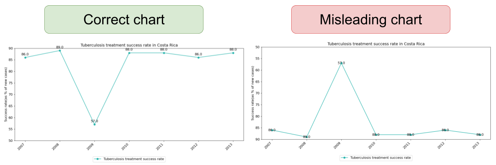

## 🛢️ AttackViz
We briefly describe the AttackViz dataset below. Each instance contains the following:

### Chart-question pair information
```json
{
        "imgname": "101179_train",
        "question": "Across all years, what is the minimum tuberculosis treatment success rate ?",
        "gold": "57",
        "question_class": "min_max",
        "possible_misleading_techniques": [
            "inverted_axis"
        ],
        "misleading_answers": {
            "inverted_axis": 89.0
        },
        "criteria": "correct-to-incorrect"
    }
```
### Correct and misleading chart JSON annotations
#### Correct chart JSON annotations
```json
{
    "title": "Tuberculosis treatment success rate in Costa Rica",
    "legend": {"Tuberculosis treatment success rate": "#20B2AA"},
    "x_axis": ["2007","2008","2009","2010","2011","2012","2013"],
    "y_axis_label": "Success rate(as % of new cases)",
    "data": [
        {
            "label": "Tuberculosis treatment success rate",
            "color": "#20B2AA",
            "values": [86,89,57,88,88,86,88]
        }
    ],
    "type": "line",
    "main_axes": {
        "y_axis": {
            "axis_range": {
                "min_value": 50,
                "max_value": 90
            },
            "show_axis": true,
            "direction": "bottom-to-top",
            "scale": "linear"
        },
        "x_axis": {
            "show_axis": true,
            "direction": "left-to-right"
        }
    },
    "image_dimensions": {
        "width": 12,
        "height": 6
    },
    "Horizontal grid": false,
    "Vertical grid": false,
    "Chart legend": true,
    "Vertical band": false,
    "Show title": true,
    "Fontsize": 12,
    "3D effect": false,
    "Show labels": true
}
```

#### Misleading chart JSON annotations
```json
{
    "title": "Tuberculosis treatment success rate in Costa Rica",
    "legend": {"Tuberculosis treatment success rate": "#20B2AA"},
    "x_axis": ["2007","2008","2009","2010","2011","2012","2013"],
    "y_axis_label": "Success rate(as % of new cases)",
    "data": [
        {
            "label": "Tuberculosis treatment success rate",
            "color": "#20B2AA",
            "values": [86,89,57,88,88,86,88]
        }
    ],
    "type": "line",
    "main_axes": {
        "y_axis": {
            "axis_range": {
                "min_value": 50,
                "max_value": 90
            },
            "show_axis": true,
            "direction": "top-to-bottom",
            "scale": "linear"
        },
        "x_axis": {
            "show_axis": true,
            "direction": "left-to-right"
        }
    },
    "image_dimensions": {
        "width": 12,
        "height": 6
    },
    "Horizontal grid": false,
    "Vertical grid": false,
    "Chart legend": true,
    "Vertical band": false,
    "Show title": true,
    "Fontsize": 12,
    "3D effect": false,
    "Show labels": true
}
```

### Correct and misleading chart images
<p align="center">
  
</p>

### Dataset structure
```
├── correct_annotations
│   ├── ChartQA
│   │   ├── test
│   │   ├── train
│   │   └── val
│   └── PlotQA
│       ├── test
│       ├── train
│       └── val
├── misleading_annotations
│   ├── ChartQA
│   │   ├── test
│   │   ├── train
│   │   └── val
│   └── PlotQA
│       ├── test
│       ├── train
│       └── val
├── questions
│   ├── ChartQA
│   │   ├── test
│   │   ├── train
│   │   └── val
│   └── PlotQA
│       ├── test
│       ├── train
│       └── val
```